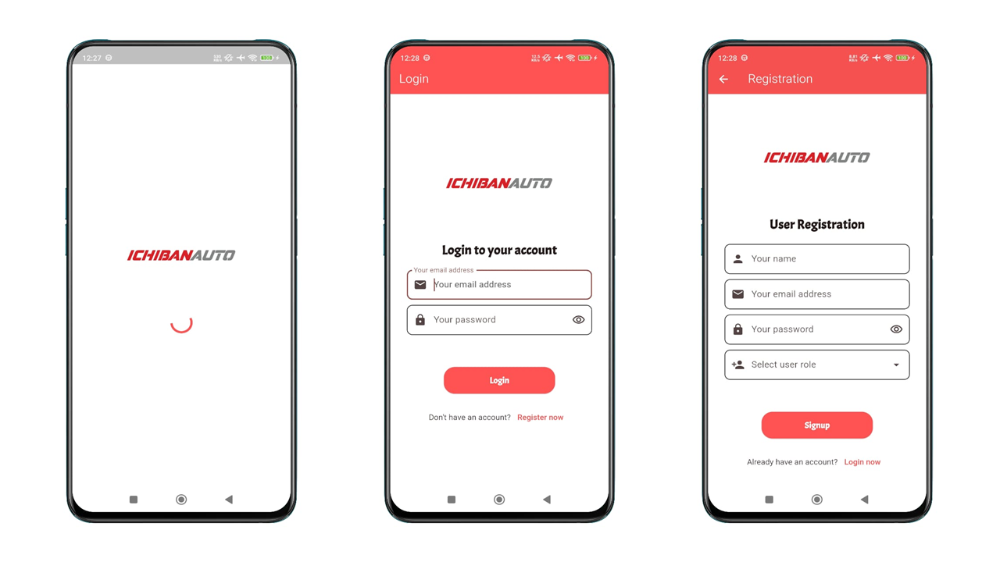
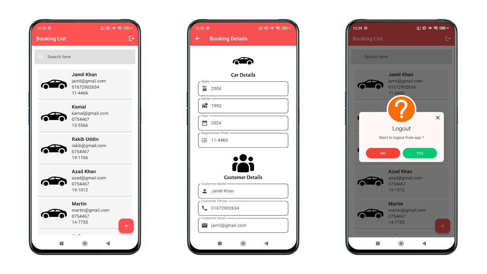
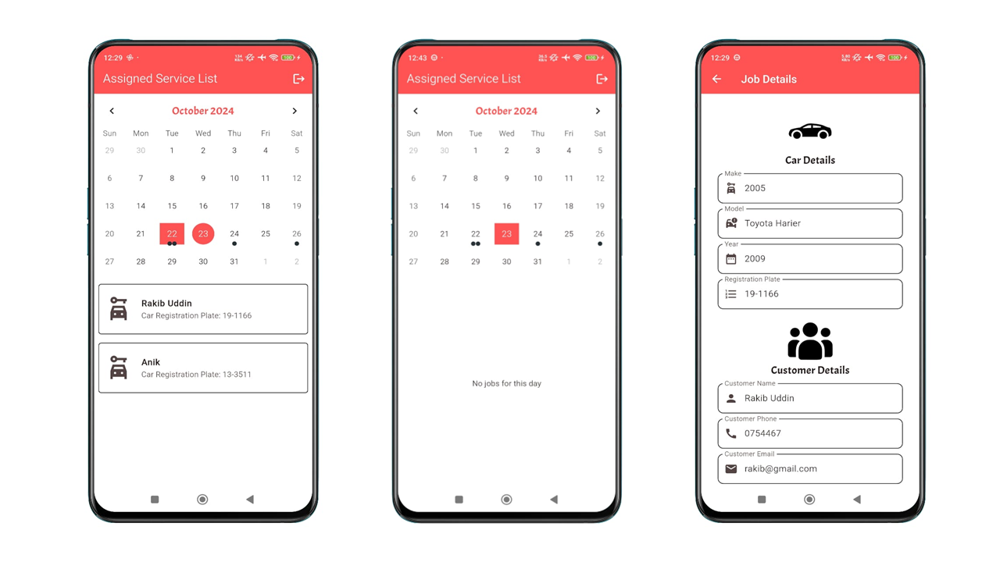

# Car Workshop Flutter App

A cross-platform mobile application for a car workshop where users can create bookings for car servicing, and view bookings in a calendar.

## App Screenshots

Here is a quick look at the app's screenshots:

## App Video

Here is a video of the app in action:
[Google Drive](https://drive.google.com/file/d/1iGp7brUy_azaPD68F0dMsh4JLNztvhoa/view?usp=sharing) - Visit the link to watch the video.

## App Features
 - Splash screen
 - User authentication (using Rest API)
 - User registration with specific user roles (e.g., admin, mechanic)
 - Admin dashboard with booking management
 - Admin can view all bookings
 - Admin can assign tasks to mechanics
 - Mechanic dashboard with assigned task
 - Mechanic can view assigned service in calendar
  
## How to Run the App

To run the app, you'll need to set up Flutter and Dart on your machine.

Steps:
- Download Android Studio from the official website: https://developer.android.com/studio
- Download JDK from the official website: https://www.oracle.com/java/technologies/javase-jdk11-downloads.html
- Download the Flutter SDK from the official website: https://docs.flutter.dev/release/archive
- Download sdk version 3.22.1
- Unzip the downloaded Flutter SDK into a directory of your choice
- Open Android Studio and install Flutter & dart plugin
- Set up Flutter SDK in your system environment variables
- Specify the Flutter SDK path in your Android Studio settings

You can check reference videos on YouTube for detailed instructions:
https://youtu.be/mMeQhLGD-og?si=rXZQVFBjGOu12aM8

After completing these steps, follow these steps to run the app:
- Open Android Studio
- Select project from version control (VCS) and paste the project URL: https://github.com/NoorMohammedAnik/car_workshop_app
- Project will be imported into Android Studio
- Finally, run the app on an emulator or a physical device

## Package used in this project
- [http](https://pub.dev/packages/http) - A composable, Future-based library for making HTTP requests.
- [getx](https://pub.dev/packages/get) - GetX is an extra-light and powerful solution for Flutter. It combines high-performance state management, intelligent dependency injection, and route management quickly and practically.
- [fluttertoast](https://pub.dev/packages/fluttertoast) - Toast Library for Flutter, Easily create toast messages in single line of code
- [get_storage](https://pub.dev/packages/get_storage) - A fast, extra light and synchronous key-value in memory, which backs up data to disk at each operation
- [internet_connection_checker](https://pub.dev/packages/internet_connection_checker) - A Pure Dart Utility library that checks for an Active Internet connection by opening a socket to a list of specified addresses, each with individual port and timeout. Defaults are provided for convenience.
- [shimmer](https://pub.dev/packages/shimmer) - A shimmering effect for Flutter.
- [intl](https://pub.dev/packages/intl) - Provides internationalization and localization facilities, including message translation, plurals and genders, date/number formatting and parsing, and bidirectional text.
- [omni_datetime_picker](https://pub.dev/packages/omni_datetime_picker) - A date and time picker for Flutter.
- [table_calendar](https://pub.dev/packages/table_calendar) - A calendar widget for Flutter.
- [awesome_dialog](https://pub.dev/packages/awesome_dialog) - A beautiful and customizable dialog widget for Flutter.
- [google_fonts](https://pub.dev/packages/google_fonts) - Load and use Google Fonts with ease in Flutter.
## Image Resources
- [FlatIcons](https://www.flaticon.com/) - Download Free Icons and Stickers for your projects. Resources made by and for designers